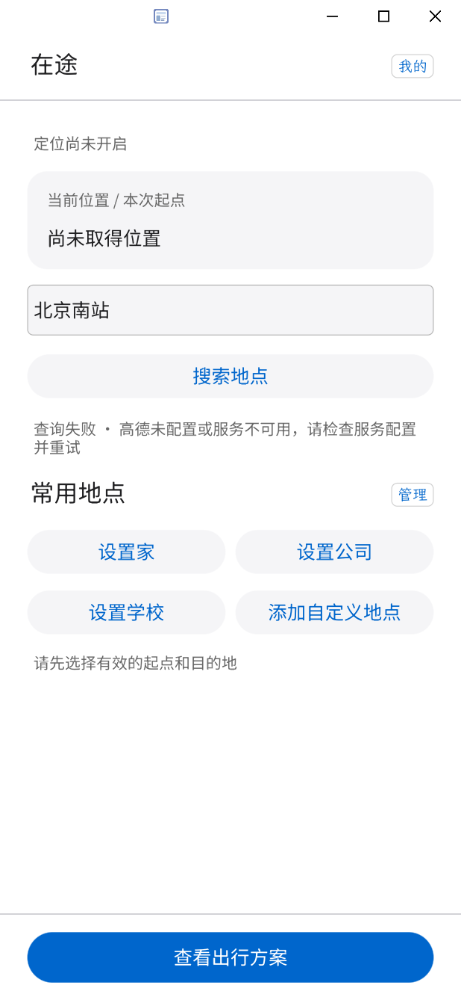

# 少糖加冰 · GOSIM 2026 Agentic App

**让 AI 理解日常，让建议落到行动。**

我们是少糖加冰团队。本仓库收录两个围绕 OctoSense 开发的生活应用：**在途 Onway** 关注出行过程，**Daycast** 关注天气与今天的安排。我们希望把地点、时间、天气和个人偏好连接起来，在用户需要的时候呈现有依据、可确认的建议。

两个应用独立维护，各自保存数据和发布版本。目前尚未打通跨应用数据共享，不将它们描述为已经联动运行的一套系统。

## 项目导航

| 应用 | 解决的问题 | 当前交付 | 入口 |
| --- | --- | --- | --- |
| **在途 Onway** | 什么时候出发、怎样到站、在哪里下车，以及如何结束和记录一次行程 | v1.0.2 审核源码与演示视频；v1.0.1 Windows 即用演示包 | [项目说明](onway/README.md) · [下载演示包](https://github.com/buqizixv/shaotangjiabing/releases/tag/onway-v1.0.1) |
| **Daycast** | 天气对穿衣、活动和日程有什么影响，如何结合个人资料做安排 | v0.4.2 OctoSense 应用包 | [项目说明](octoscript-weather-assistant/README.md) · [下载应用包](https://github.com/buqizixv/shaotangjiabing/releases/tag/v0.4.2) |

## 在途 Onway：从准备出发到到达

**[观看 Onway 项目介绍（约 6 分 34 秒）](https://github.com/buqizixv/shaotangjiabing/releases/download/onway-v1.0.2/Onway-Introduction.mp4)** · [v1.0.2 资料与视频](https://github.com/buqizixv/shaotangjiabing/releases/tag/onway-v1.0.2)

桌面录屏展示出发邀请、路线选择、动态卡片和 AI 总结；保留原声与操作，包含人工纠正演示，不作为完整户外实测证据。

在途用随行程阶段变化的卡片，呈现当下需要的出行信息。用户输入目的地或选择常用地点，比较真实查询得到的路线，再自主选择方案。进入行程后，信息重点随步行、候车、乘车和到达而变化。

- **出行规划：**目的地搜索、常用地点，比较预计时长、步行距离和换乘次数。
- **动态行程：**准备出发、步行指引、公交候车、乘车与到达总结；支持按当前阶段人工纠正。
- **通勤建议：**保存固定通勤地点、上下班时间与通勤日期，结合路线预估、天气及个人偏好提供出发邀请。
- **AI 推荐与记忆：**在用户开启 AI 功能后生成路线建议、行程总结和个性化记忆；推荐不替用户决定出发。
- **记录管理：**完成行程后保留历史，可删除单条或清空；中途结束直接返回主页，不生成完成历史。

地图、天气与 MiniMax 调用经过密钥中转网关，上游密钥保存在服务器；北京公交到站使用第三方接口。数据不可用时显示失败或缺失状态，不补造班次。

### 体验在途

1. 在 [Onway v1.0.1 发布页](https://github.com/buqizixv/shaotangjiabing/releases/tag/onway-v1.0.1) 下载 `Onway-v1.0.1-Windows-x64.zip`。
2. 完整解压，双击 `Onway.exe`。演示包包含配套宿主、Python 后台和共享网关访问凭证，无需另填凭证。
3. 允许所需的设备定位权限，或手动设置起点；选择目的地和方案后开始体验。AI 功能在“出行习惯”中开启。

**当前交付边界：**演示包使用定制宿主。本机隔离环境已验证启动、地图与 AI 服务连接；其他电脑和完整户外连续行程仍需实测。普通 OctoSense 仅安装 `onway/bundle` 尚不能运行完整功能，无配套后台时会显示依赖说明。当前没有实时道路拥堵判断，也不保证系统通知或休眠后的连续定位。

[App Hub 人工审核申请 #102](https://github.com/OctoSense-org/OctoSense-App-Hub/issues/102) 已提交，正在请求确认宿主接入方式；**提交不等于上架或标准宿主适配完成**。详见 [接入说明](onway/docs/AppHub提交说明.md) 与 [检查、自检材料](onway/docs/apphub-review/)。

## Daycast：让天气进入今天的安排

Daycast 将天气、衣橱、偏好、日程和家庭关注城市放在一起，帮助用户回答“今天怎么安排”。它通过 OctoSense 助手处理自然语言，给出建议或待确认草案；新增个人资料由用户确认后保存。

- **天气与城市：**查看当前天气、小时和未来预报；搜索、保存并切换关注地点。
- **出门建议：**结合天气、怕冷怕热等偏好、已有衣物和日程，提供穿衣与活动建议。
- **衣橱管理：**记录衣物类型和家中存放位置；在宿主支持时选取或拍摄照片，照片留在本机。
- **日程与偏好：**用自然语言起草安排，检查时间和冲突；将天气关注点整理成可确认的条件。
- **家庭城市：**保存家人所在城市和本机提醒偏好，方便关注异地天气。

天气与地点查询来自 Open-Meteo；AI 通过 OctoSense 宿主会话能力处理，模型提供方、凭据和授权由宿主管理。

### 体验 Daycast

在 [Daycast v0.4.2 发布页](https://github.com/buqizixv/shaotangjiabing/releases/tag/v0.4.2) 下载应用包，按 [项目说明](octoscript-weather-assistant/README.md#运行与检查) 使用 OctoSense / 官方开发工具加载。联网查询需要网络；助手功能需要支持相应服务的宿主，并由用户完成 AI 设置和授权。照片选择等能力也取决于宿主是否支持包内声明的权限。

**当前交付边界：**GitHub 发布的应用包不代表已获 App Hub 准入。家庭城市和提醒偏好目前保存在本机，尚不会主动发送系统通知、Matrix 消息或家庭消息；空气质量尚未接入。

## 界面预览

截图展示各自应用的运行页面。Onway 首页由参考宿主加配套后台运行；Daycast 首页展示演示地点、天气和生活资料。两者不作为同一次真实生活过程或完整户外实测的证据。

<table>
  <tr>
    <td align="center"><strong>在途 Onway · 出行首页</strong><br></td>
    <td align="center"><strong>Daycast · 今日建议</strong><br></td>
  </tr>
</table>

## 技术与数据

两款应用的界面入口都是 OctoScript 应用包中的 Splash 脚本。Daycast 通过标准脚本网络与宿主助手接口实现功能；Onway 的完整桌面体验还依赖 Python 后台和 Rust 宿主扩展，相关源码及补丁一并公开。

| 内容 | 在途 Onway | Daycast |
| --- | --- | --- |
| 界面入口 | [`onway/bundle/main.splash`](onway/bundle/main.splash) | [`octoscript-weather-assistant/bundle/main.splash`](octoscript-weather-assistant/bundle/main.splash) |
| 外部数据 | 地图、天气、第三方公交到站 | Open-Meteo 天气与地理编码 |
| AI 路径 | MiniMax，经在途网关调用 | OctoSense 宿主助手会话 |
| 本机资料 | 常用地点、通勤、行程历史、AI 记忆 | 城市、偏好、衣橱、日程、家庭城市 |
| 隐私说明 | [Onway 隐私说明](onway/PRIVACY.md) | [Daycast 隐私说明](octoscript-weather-assistant/PRIVACY.md) |

个人运行目录、上游密钥和私钥不提交到源码仓库。Onway 即用演示包另含共享网关访问凭证；AI 分析会向云端服务发送任务所需上下文。Daycast 衣物照片留在应用本机存储，助手接收相关文本上下文。具体数据处理和删除边界以各应用隐私说明为准。

Onway 首次运行导入 10 条项目作者指定的历史记录：路线来自接口查询，日期与完成用时为编写导入，不代表定位核验的真实完整行程。用户可在历史页删除或清空。

## 仓库结构与版本

```text
shaotangjiabing/
├── README.md                         # 少糖加冰团队与项目导航
├── LICENSE                           # Apache-2.0
├── onway/                            # 在途
│   ├── bundle/                       # 脚本界面、清单、资源与截图
│   ├── backend/                      # Python 配套后台
│   ├── gateway/                      # 密钥中转网关
│   ├── runtime/                      # 定制宿主集成补丁
│   └── docs/                         # 产品、宣传片与审核说明
└── octoscript-weather-assistant/      # Daycast
    ├── bundle/                       # 脚本应用与资源
    ├── docs/                         # 使用说明与流程截图
    └── PRIVACY.md                     # 数据和隐私说明
```

应用版本以各自的 `bundle/manifest.json` 为准。在途标签统一使用 `onway-v<版本号>`，当前有 `onway-v1.0.0`、`onway-v1.0.1`、`onway-v1.0.2`；较早的 `onway-v0.5.4` 也保留。Daycast 当前发布标签为 `v0.4.2`。Git 标签标记整个仓库的提交，应用下载附件则按项目区分。

## 反馈与许可证

请通过 [Issues](https://github.com/buqizixv/shaotangjiabing/issues) 提交问题，并注明 **Onway** 或 **Daycast**、版本、宿主版本和复现步骤。不要在反馈中粘贴 API 密钥、访问凭证或私钥。

项目使用 [Apache-2.0](LICENSE) 许可证。OctoSense 及相关工具链、字体与依赖的许可证以各自声明为准。
