# Daycast｜让天气进入今天的安排

## 视频介绍

**[观看或下载 Daycast-Onway-promo-remix（2 分 40 秒）](https://github.com/buqizixv/shaotangjiabing/releases/download/v0.4.3/Daycast-Onway-promo-remix.mp4)**

Daycast 与 Onway 宣传视频。视频中的宣传画面与演示内容不作为完整户外实测或跨应用联动已实现的证明。


Daycast 是运行在 OctoSense 上的天气与日程助手。它将实时天气、个人衣橱、天气偏好、日程与家庭关注城市放进同一条生活决策链：先理解环境和个人情况，再给出可执行的建议；需要修改个人资料时，先展示草案，由用户确认。

## 一句话介绍

**OctoSense 的 AI 可以把需要天气与个人生活上下文的任务交给 Daycast；Daycast 结合应用资料和天气服务完成专门处理，再把解释、建议或待确认操作带回个人通道。**

这让 Daycast 不只是一个需要用户单独打开的天气页面。它也是 OctoSense AI 操作系统里的垂直能力：系统助手可以在用户的会话中调用 Daycast 的天气、衣橱、偏好和日程能力；Daycast 也能通过 OctoSense 助手服务处理自然语言、生成出门建议与结构化草案。应用只处理完成任务所需的上下文，具体调用仍遵循 OctoSense 的宿主能力、当前账号、授权和 AI 设置。

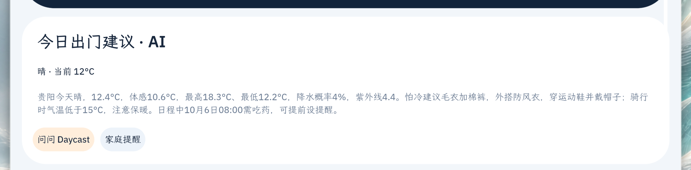

*真实运行截图：建议综合贵阳天气、怕冷偏好、骑行提醒、衣物与次日日程，帮助用户把预报转成准备行动。*

## 产品理念

### 从天气数据到生活行动

天气数值本身不是最终答案。用户真正想知道的是“骑车要不要加衣”“带不带伞”“这项安排放在什么时候合适”。Daycast 将天气与用户愿意记录的衣物、偏好和日程放在一起，让建议有个人上下文，也能落到行动上。

### 把天气关注延伸到家人身边

天气关注的不只是自己所在的城市。用户可以记下父母或其他家人居住的城市，在同一个 Daycast 里查看这些异地地点并纳入日常关注。这样，天气助手承载的不只是个人出行准备，也包括对家人的惦念：了解家人所在城市的天气，更容易想到提醒添衣、带伞或留意天气变化。

### 专业应用能力可以参与系统级协作

OctoSense 是 AI 操作系统，Daycast 是其中理解天气与日常安排的专门应用。通过 OctoSense 的个人通道与助手会话能力，系统 AI 可以把相关请求交给 Daycast；Daycast 使用应用的领域上下文与天气服务完成任务，并将结果返回给用户。AI 能力因此可以跨越单个页面，在系统对话中协作完成具体工作。

### AI 起草，人决定，应用校验

Daycast 可以从自然语言中理解事件、衣物、天气偏好和家庭城市。对新增资料，应用先呈现识别结果和必要解释；用户确认后才写入。日程还会检查时间格式、前后关系与冲突；家庭城市会展示地点匹配结果。AI 负责理解和建议，应用负责数据约束，最终决定权留给用户。

### 让数据来源和能力边界清楚

天气与地理编码由 Open-Meteo 提供；生活资料保存在应用私有存储。衣物照片保存在本机，不会发给天气服务或助手。家庭城市、天气基线及提醒记录保存在本机；在本次升级的 OctoSense 宿主中，天气变化提醒可通过内置 Rinx 发送。

## OctoSense 系统 AI 与 Daycast 如何协作

Daycast 的集成基于 manifest 声明的 `octos.session.open` 与 `octos.turn.start` 能力。应用可以打开由宿主管理的助手会话，并提交这一轮与当前任务有关的内容。OctoSense 管理模型提供方、凭据及宿主侧的工具和授权；Daycast 不内置或收集模型 API Key。

从用户视角看，协作是一个连续过程：系统 AI 将天气相关任务路由到 Daycast 的个人通道；Daycast 结合当前城市、天气、衣橱、偏好或日程理解问题；然后在会话中给出回答，或生成一张待确认卡片。对于写入衣橱、日程、偏好和家庭城市的操作，用户确认前不会保存。

```text
用户在 OctoSense 对话中提出任务
                  ↓
OctoSense 系统 AI 将任务交给 Daycast 个人通道
                  ↓
Daycast 结合天气服务与应用内相关资料处理
                  ↓
返回解释、建议或待确认草案
                  ↓
用户确认后，Daycast 才保存个人资料
```


*真实运行截图：用户说“卧室放了一件防风衣”。Daycast 解释识别结果、衣物类型和位置，并明确等待用户确认。*

这种协作方式体现了 Agentic App 的价值：系统 AI 能使用应用的专门能力，应用则以明确的数据边界和可确认的操作承接任务。用户不必在多个孤立工具间重复描述同一件事，也能看清每项资料何时会被保存。

## 功能与使用说明

### 1. 今天：把天气、个人情况和日程放在一起

“今天”页展示当前城市、天气状况、气温与体感、最高/最低温、降水概率和紫外线，并给出穿衣或出门建议。建议可结合用户设置的怕冷/怕热等偏好、衣橱物品和当天日程。点击“问问 Daycast”可以继续用自然语言追问；“家庭提醒”入口可查看家庭城市相关设置。

**怎么用：**打开“今天”查看当前天气和建议；点刷新重新获取天气；要了解建议依据或继续规划时，进入 Daycast 问答。


### 2. 城市管理与搜索：保存常用地点并切换天气上下文

Daycast 支持保存多个常用城市，并从城市列表切换当前天气地点。搜索时先匹配常用地点索引；需要在线查询时使用 Open-Meteo 地理编码，并展示城市、省州和国家等层级，方便区分同名地点。无匹配或请求失败时，应用会提示状态，不会把未确认的候选地误当成已添加。

**怎么用：**在“今天”页打开当前城市入口进入城市管理；选择已保存城市即可切换。添加新地点时搜索城市或景区，核对地点层级后选择并保存。

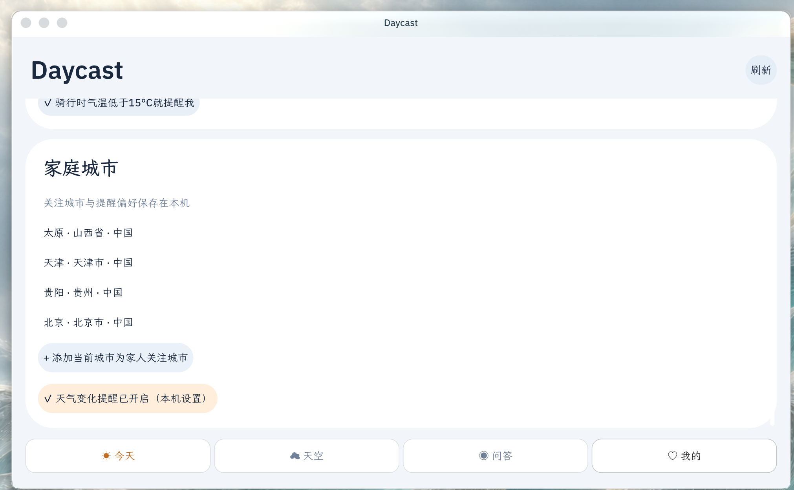

### 3. 天空：查看逐小时与未来七天趋势

“天空”页用于查看逐小时预报以及未来七天的天气和温度范围，帮助用户挑选活动时间、提前准备。数据由所选地点的天气预报提供，具体可用时段和准确性受上游数据与网络影响。

**怎么用：**进入底部“天空”页查看逐小时变化，再向下浏览七天预报；需要更新时点刷新。

*本轮提供的真实运行截图集中展示个人通道、确认流程、衣橱、偏好和家庭城市；天空页的最新运行截图待补。*

### 4. Daycast 问答：直接提问，或指定要完成的任务

问答页支持开放式天气问题，也提供四个任务入口：**创建日程、添加衣物、创建天气偏好、添加家庭城市**。任务按钮为当前消息说明意图；可以在文字中补充时间、衣物位置、偏好阈值或家庭成员所在城市。

**怎么用：**选任务按钮，输入自然语言并发送；Daycast 会回复理解结果、继续询问缺少的信息，或展示待确认卡片。用户可以确认或取消。

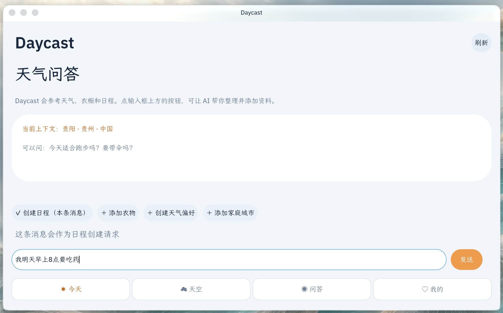

### 5. 日程：自然语言起草，并检查冲突

用户可以直接管理日程，也可以让 Daycast 从对话中整理事项和时间。生成日程草案时，Daycast 会说明日期、起止时间以及与已有安排是否冲突；若有相关天气信息，也会作为安排建议的参考。确认后才加入日程表。

**怎么用：**在“我的”进入日程表手动新增，或在问答中选择“创建日程”并描述安排；核对待确认草案后点“确认并添加”。

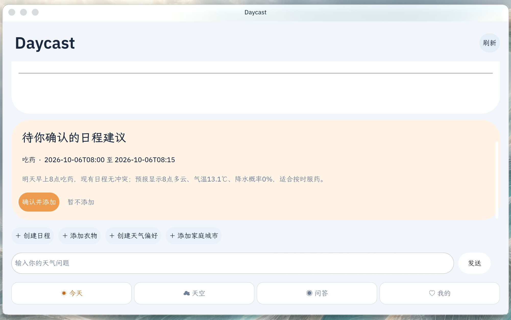

### 6. 衣橱：记下衣物和它在家里的位置

衣橱保存衣物类型及可选的存放位置，方便出门建议引用，也方便用户日常查找。列表支持编辑位置和移除衣物。用户可以在对话中自然描述衣物与位置，由 Daycast 起草条目。

**怎么用：**进入“我的”→“管理衣橱”维护条目；或在问答中点“添加衣物”，描述衣物及存放位置，核对后确认添加。存放位置也可留空。

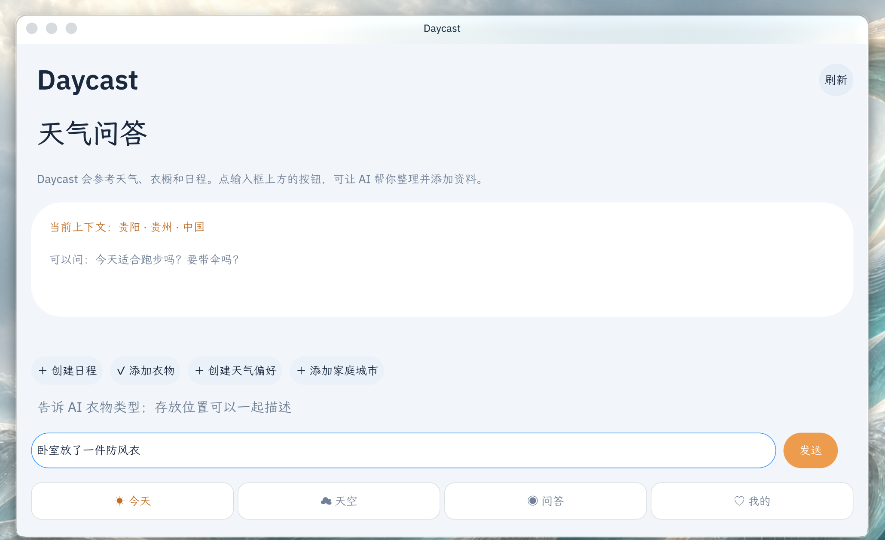

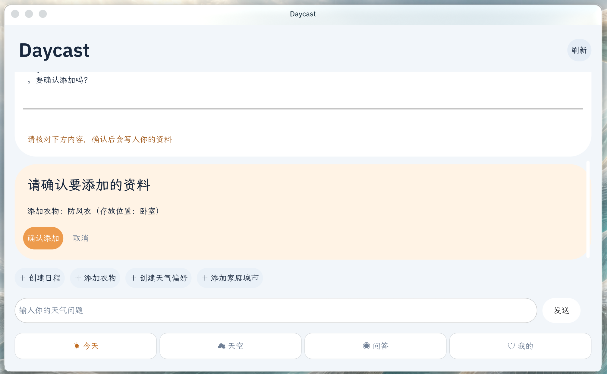

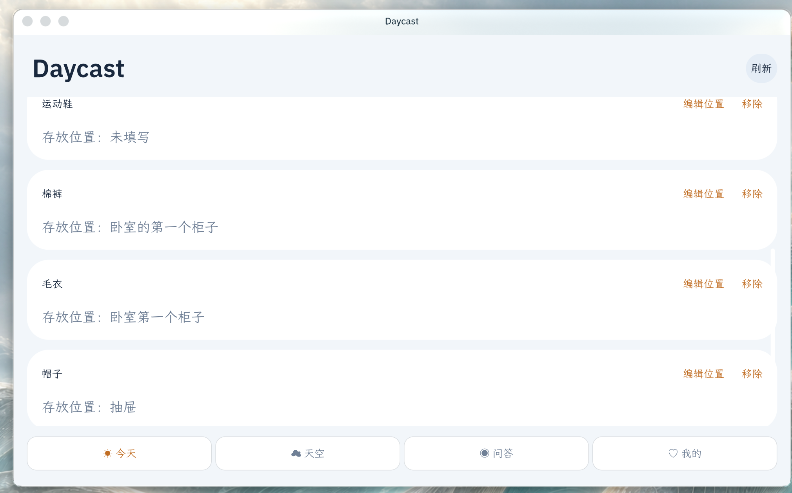

衣物照片可以通过照片选择或应用内相机添加（取决于宿主提供的权限），并保存在 Daycast 应用私有空间。当前实现不会将照片上传到天气服务或交给 AI；发送给助手的衣物上下文是衣物类型、存放位置及是否有照片等文本信息。

### 7. 天气偏好：将“我关心什么”变成可用的提醒条件

用户可以选择怕冷、怕热、关注紫外线和降雨等偏好，也可以告诉 Daycast 自己关心的活动。Daycast 会区分宽泛兴趣和可以判断的天气条件；信息不足时先追问阈值，再提出清晰的偏好草案。保存后的偏好会用于后续天气建议。

**怎么用：**在“我的”管理现有偏好；或者在问答选择“创建天气偏好”，描述关注点并补齐触发条件，核对后确认。

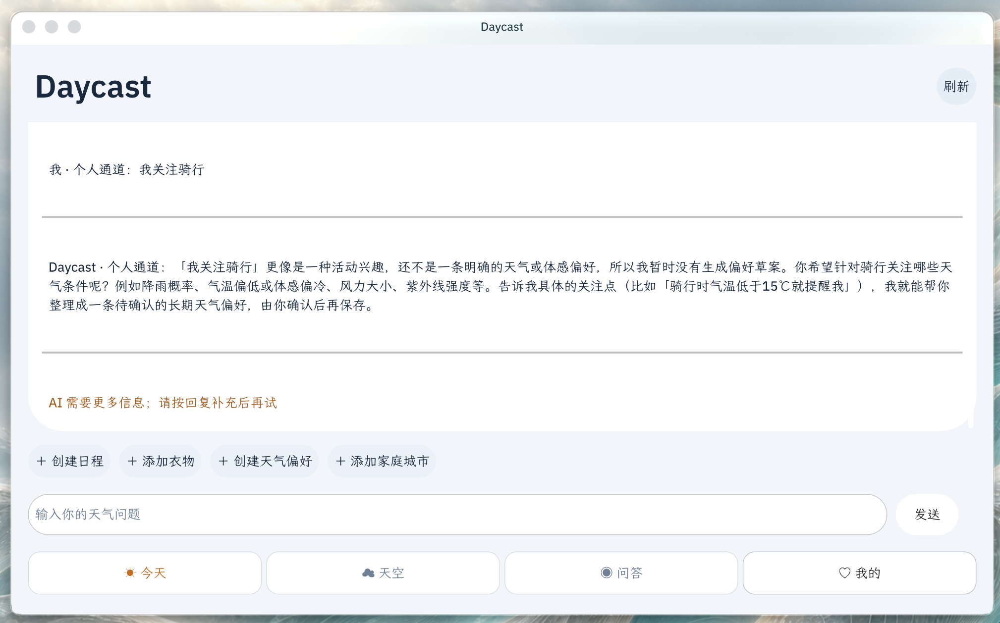

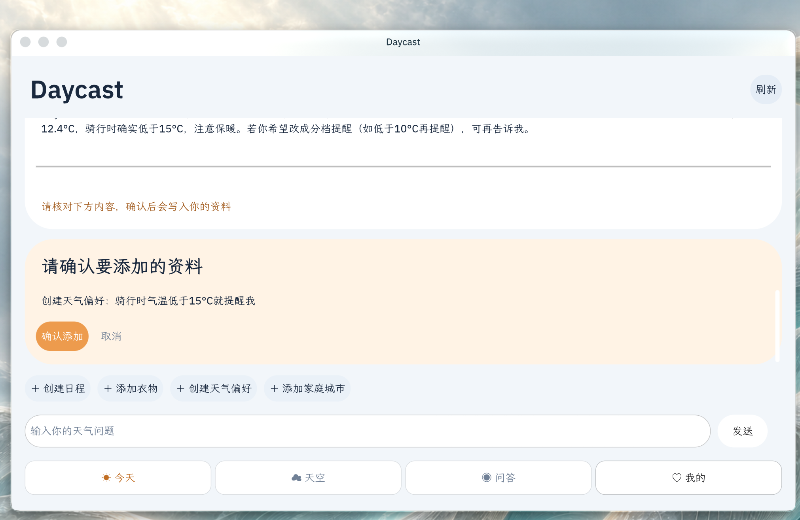


### 8. 家庭城市：关注家人所在城市的天气

用户可以把父母或其他家人所在的城市加入家庭关注列表。比如说“我爸爸在北京”，Daycast 会识别地点、查询匹配结果，并在用户确认后保存。家庭城市与自己的当前城市一起管理，方便查看异地家人的天气，也能配置天气变化提醒偏好。这让天气服务自然延伸到跨城市的家庭关怀。

**怎么用：**在“我的”页面查看家庭城市；可以用“添加当前城市为家人关注城市”，也可以在问答中选择“添加家庭城市”，说出家人和城市。检查候选地点后确认加入。

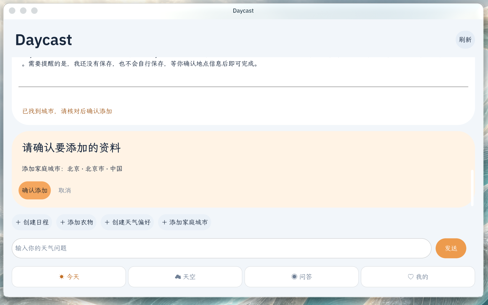


**Rinx 提醒：**在「我的」读取并选择家人聊天室，再开启 Rinx 提醒。应用打开期间每 15 分钟检查家庭城市，首次只建立基线；天气变化后生成正文，交由 Rinx 展示聊天室与完整消息供用户确认。仅在发送成功后标记已发送，失败可重试。此功能需要本次升级的 OctoSense 宿主，独立 card-host 不提供桥接。详见 [配置与使用说明](docs/rinx-family-reminders.md)。关闭应用后停止检查。

### 9. 我的：维护个人资料和常用功能

“我的”页面汇总衣橱、日程表、天气偏好、家庭城市和提醒开关。用户可以通过管理入口更新或删除资料；首页建议会在相关场景使用这些内容。

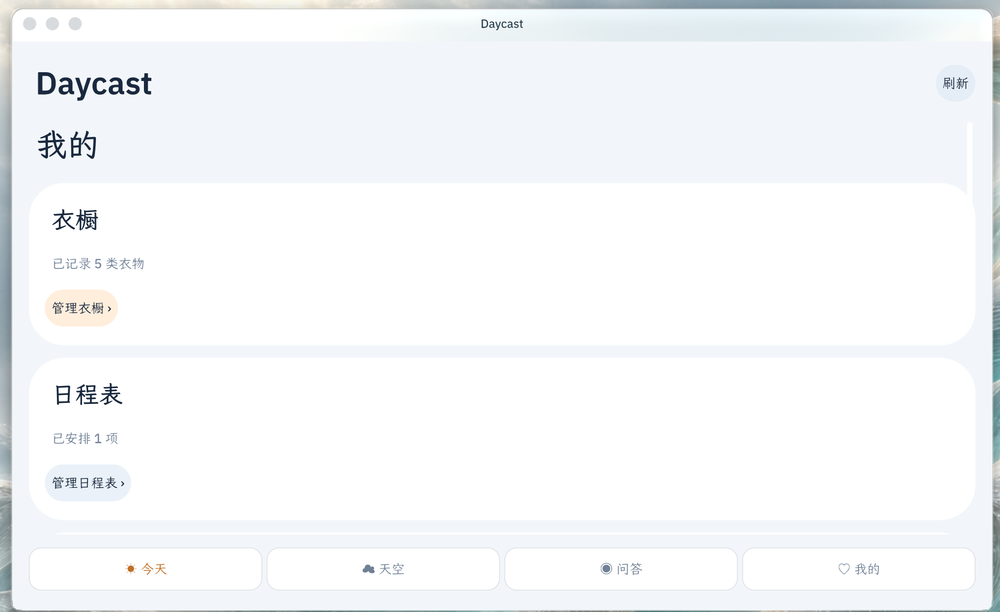

## Daycast 的特点

| 用户需要 | Daycast 提供的能力 |
| --- | --- |
| 想知道天气对今天有什么影响 | 把预报与穿衣、活动和日程建议放在一起。 |
| 希望系统 AI 能完成具体垂直任务 | 通过 OctoSense 个人通道和助手会话能力，让系统 AI 可以调用 Daycast 的天气与生活规划能力。 |
| 不想反复解释个人情况 | 在用户同意记录后，用衣橱、偏好、日程和家庭城市提供相关上下文。 |
| 想顺手关注异地家人的天气 | 将家人所在城市加入家庭关注，在一个天气助手中照看自己与家人的天气情况；在支持桥接的 OctoSense 中，可开启天气变化后的 Rinx 提醒。 |
| 担心 AI 未经同意修改资料 | 对新增内容先出草案；校验后仍需用户确认才保存。 |
| 想理解建议从何而来 | 对话回复可说明天气、地点、已有日程或偏好等依据。 |
| 在意个人资料和照片边界 | 生活资料保存在应用私有空间；衣物照片留在本机，不发送给天气 API 或 AI。 |

## 与 Agentic App 比赛方向的关系

Daycast 对应 OctoSense 场景中的天气与活动规划：从自然语言任务出发，调用天气数据并读取用户选择提供的生活上下文，再给出建议或结构化操作。当前版本聚焦天气、衣橱、偏好和活动计划，尚未接入空气质量数据；后续可按比赛天气场景的完整任务扩展数据源与验证流程。作品的重点是让系统 AI 能在个人通道中调用专业应用，并用“AI 理解和规划—应用校验—用户确认—结果持久化”的闭环完成真实任务。

这一设计将 Agent 协作落在可观察的行为上：系统助手可以调用 Daycast 的垂直能力，Daycast 能返回天气解释、行程草案和个人资料建议；冲突检查、地理编码与确认卡片让结果可核对，用户对个人资料保有最终控制。比赛对“围绕 OctoSense、从真实场景出发并展示 Agent 自动化任务”的方向，见 [Agentic App 2026 仓库](https://github.com/gosimfoundation/hackathon-agenticapp26)与仓库的 [OctoSense 场景说明](https://github.com/gosimfoundation/hackathon-agenticapp26/blob/main/docs/octosense-scenario-update-plan.md)；OctoSense 天气场景介绍见 [OctoSense Apps](https://octosense.org/cn/#apps)。

## 数据、权限与隐私

- **天气数据：**Open-Meteo Forecast API 根据所选地点的经纬度提供天气信息。
- **地点搜索：**本地常用地点优先匹配；在线查询使用 Open-Meteo Geocoding API。
- **生活资料：**当前城市、偏好、衣橱、日程、家庭城市和提醒开关写入 OctoSense 分配给 Daycast 的应用私有存储。
- **OctoSense AI：**使用问答或出门建议时，Daycast 通过 `octos.session.open` 和 `octos.turn.start` 使用宿主助手。相关问题及天气、偏好、衣橱和日程文本上下文会用于当前任务；提供方、凭据与宿主侧可用工具由 OctoSense 管理。
- **衣物照片：**存储在 Daycast 应用私有空间，不发送给天气 API 或 AI。
- **写入控制：**AI 提出的日程、衣物、偏好和家庭城市草案都要由用户确认后保存。
- **提醒：**家庭城市、基线、最近 20 条提醒和家人聊天室 ID 保存在本机。开启 Rinx 后，消息通过宿主原生客户端发送，并需在 Rinx 确认；账号凭据不交给 Daycast。不提供关闭应用后的后台推送。

详见 [隐私说明](PRIVACY.md)、[`bundle/manifest.json`](bundle/manifest.json) 和 [`bundle/main.splash`](bundle/main.splash)。

## 截图说明

本版以用户提供的 Daycast 当前运行截图为产品流程依据，展示今天建议、个人通道、日程草案、衣橱、偏好和家庭城市等实际界面。截图中的地点、日期、温度及资料属于演示数据；具体天气会随地点和时间变化。天空页最新真实运行截图本轮未提供，因此文字描述以应用现有功能为准。

项目图片按画面内容命名；图标、App Hub 截图和说明文档截图的完整清单见 [图片索引](docs/product-guide/assets/图片索引.md)。

## 运行与检查

Daycast 使用 OctoScript 编写，主要源码是 [`bundle/main.splash`](bundle/main.splash)。在已准备 OctoScript-App-Design-Flow 与 OctoSense App Hub 工具的环境中，可运行：

```powershell
python <OctoScript-App-Design-Flow 路径>\tools\octo check bundle
python <OctoScript-App-Design-Flow 路径>\tools\octo run bundle --port 8141
python <OctoScript-App-Design-Flow 路径>\tools\octo shot 8141 preview.png
```

完整助手交互需要支持 OctoSense `octos` 会话能力的宿主，并由用户完成相应授权和模型设置；天气与地理编码需要网络连接。应用版本与声明能力见 [`bundle/manifest.json`](bundle/manifest.json)。许可证为 Apache-2.0，见 [LICENSE](../LICENSE)。
