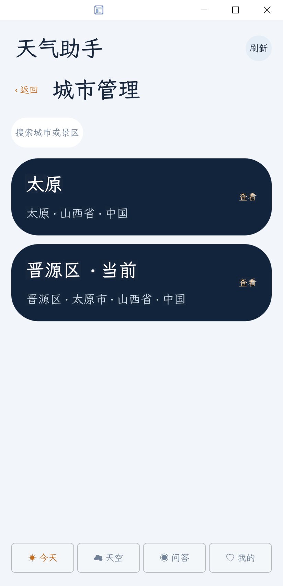
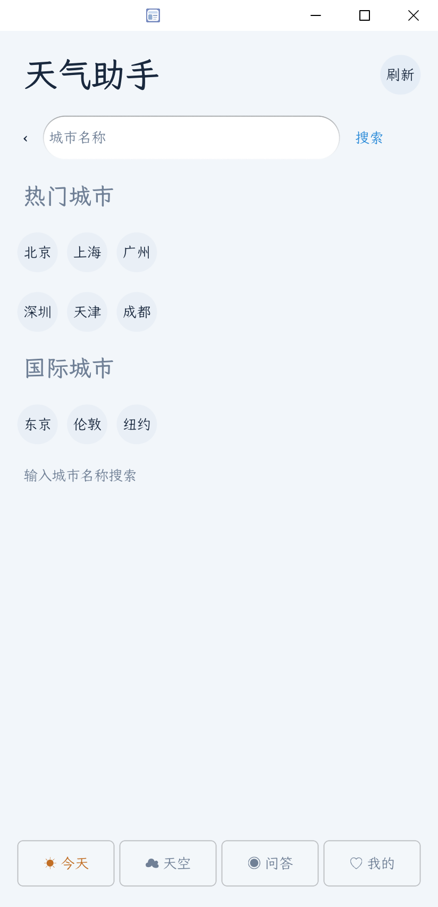
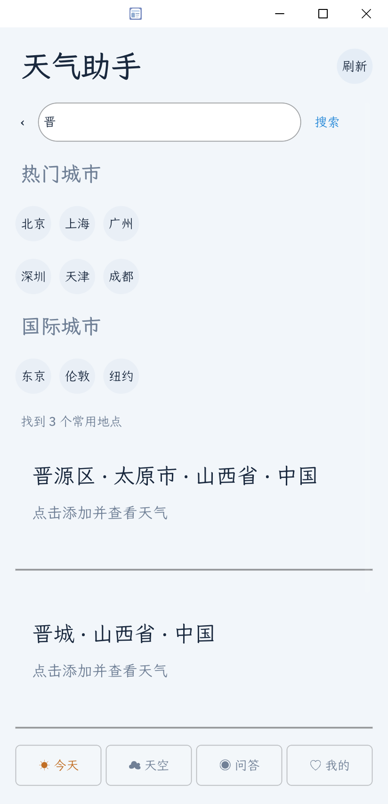
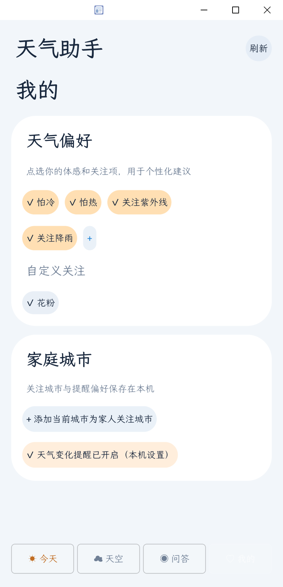

# Daycast · OctoScript 天气与日程助手

这是一个面向 OctoSense App Hub 的 contained 应用。应用逻辑使用 OctoScript 编写，源文件是 [`bundle/main.splash`](bundle/main.splash)；`bundle/manifest.json` 描述应用权限和网络域名，`bundle/listing.json` 保存应用展示信息。

仓库首页的 [README](../README.md) 介绍项目背景、产品意图、页面流程、架构、代码片段、截图和验证状态。这里聚焦应用自身。

## 产品目标

把“看天气”和“安排今天”连在一起：查看当前城市天气，切换地点、浏览小时和 7 天预报，并在衣橱、日程和天气偏好基础上获得出行建议。

城市切换按用户给的手机界面流程实现：**首页点城市 → 城市管理 → 搜索或选热门城市 → 选择地点 → 保存并返回天气首页**。输入常见中文关键词时，应用会优先从本地地点索引返回候选；找不到时再请求在线地理编码服务。

## 页面

- **今天**：当前城市、温度、天气状况、体感和今日高低温；AI 建议会参考衣橱及当日日程。
- **城市管理**：浏览已保存地点，点击卡片切换城市。
- **城市搜索**：热门国内外城市和关键词搜索；结果显示地点层级并可直接添加、查看天气。
- **天空**：逐小时预报与未来 7 天预报。
- **问答**：向 OctoSense 宿主助手发送天气、衣橱、日程及用户问题。输入框上方可选择“创建日程”“添加衣物”“创建天气偏好”或“添加家庭城市”模式；AI 根据这条消息整理待添加内容，确认卡片展示后才写入。家庭城市会先查找匹配地点。日程模式下，助手会参考已有安排推荐时间，用户确认后才保存。
- **我的**：衣橱、日程表、偏好标签、自定义“+”标签、家庭关注城市及本机提醒开关。

衣橱条目还可以选填家中存放位置，并从相册/文件选择或用相机拍一张衣物照片。保存衣物时会回显已保存的位置；衣物卡片在单独一行显示位置，点击“编辑位置”可补填或修改。问答的“添加衣物”模式可以从文字提取衣物类型和明确说出的存放位置，确认后写入；照片仍在“我的”页面添加。图片只保存在应用私有空间；照片不会发送给天气服务或 AI。

## 截图

截图由本机 card-host 实际运行生成：

<table>
  <tr>
    <td align="center"><strong>城市管理</strong><br></td>
    <td align="center"><strong>热门城市搜索</strong><br></td>
  </tr>
  <tr>
    <td align="center"><strong>搜索“晋”的候选结果</strong><br></td>
    <td align="center"><strong>偏好与自定义标签</strong><br></td>
  </tr>
</table>

## OctoSense 助手

应用使用 `octos.session.open` 打开本应用的助手会话，再用 `octos.turn.start` 生成首页建议和回答天气/日程问题。模型提供方和凭据由 OctoSense 宿主管理，应用不收集 API 密钥。首次使用需要用户授权，并要求宿主已配置可用 AI。

本机 card-host 不提供 OctoSense 助手服务，所以预览只能验证不可用提示。真实问答需要在支持 `octos` 的 OctoSense 宿主中确认授权后验证。

## 数据和网络

- `storage` 保存当前城市、城市列表、偏好标签、衣橱、日程、家庭城市和提醒开关，数据写入应用私有目录。
- `net` 访问 `api.open-meteo.com` 天气服务，以及 `geocoding-api.open-meteo.com` 地理编码服务。
- `octos.session.open`、`octos.turn.start` 连接宿主助手；用于生成建议或回答时，相关天气、衣橱、日程和偏好会包含在上下文中。
- 当前版本不发送 Matrix 消息，也不创建系统通知。家庭提醒目前是保存在本机的设置项。
- 天气偏好已能保存和编辑；首页个性化建议逻辑仍是基础版，后续还要把每种偏好接入天气判断。

详情见 [`PRIVACY.md`](PRIVACY.md)。

## 开发与检查

开发需要官方 [OctoScript-App-Design-Flow](https://github.com/OctoSense-org/OctoScript-App-Design-Flow) 工具链和 [OctoSense App Hub](https://github.com/OctoSense-org/OctoSense-App-Hub) 的 card-host。准备好工具链后，在本目录运行：

```powershell
python <OctoScript-App-Design-Flow 路径>\tools\octo check bundle
python <OctoScript-App-Design-Flow 路径>\tools\octo run bundle --port 8141
python <OctoScript-App-Design-Flow 路径>\tools\octo shot 8141 preview.png
```

应用包已通过本地 App Hub 检查。当前受限运行环境未能完成天气 API 请求；需要在可联网的宿主上刷新验证。App Hub 正式发布还需要签名、发布资料确认和人工提交。
