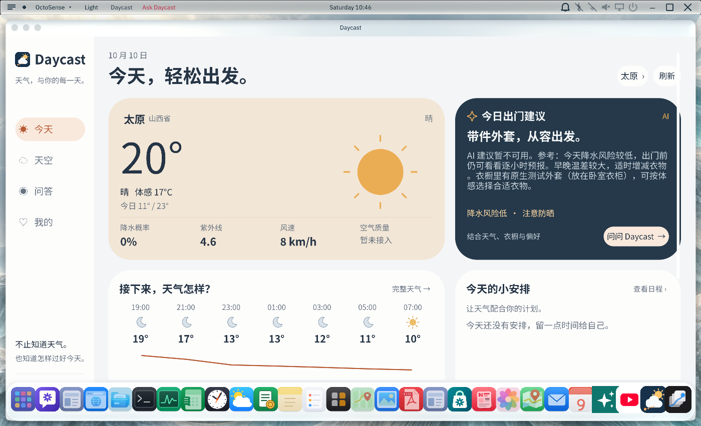
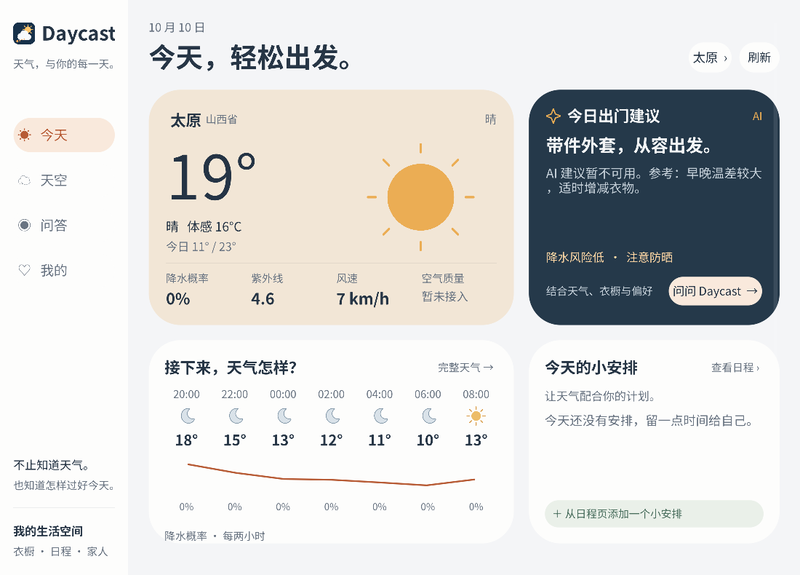
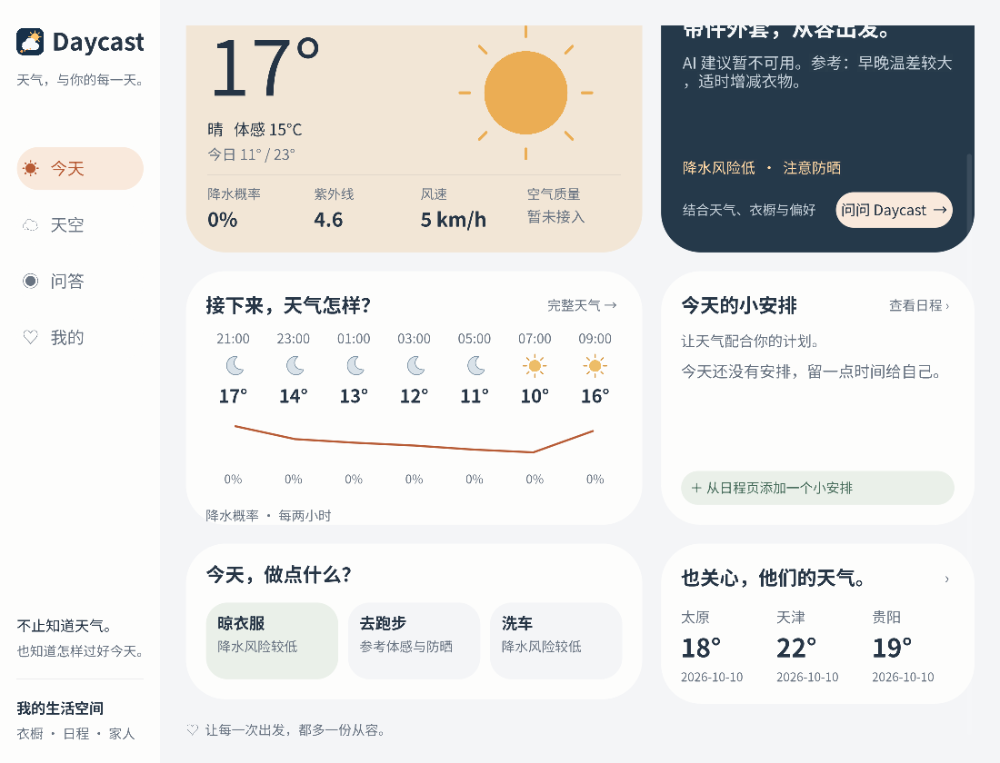

# Daycast 全页面 UI 改版

这是已实现的原生 OctoScript 页面截图，来自隔离的 Windows 验证环境。天气、城市、衣橱与日程是该环境的测试资料；衣物照片使用本地示例图。当前商店应用 ID 保留为 `weather-assistant`，截图验证时的内置系统应用 ID 为 `os.weather-assistant`。

| 页面 | 实际运行截图 |
| --- | --- |
| 今天 | [today.png](today.png) |
| 天空 | [sky.png](sky.png) |
| 问答 | [qa.png](qa.png) |
| 我的 | [mine.png](mine.png) |
| 城市管理 | [cities.png](cities.png) |
| 搜索城市 | [search.png](search.png) |
| 衣橱 | [wardrobe.png](wardrobe.png) |
| 拍摄照片 | [wardrobe-camera.png](wardrobe-camera.png) |
| 衣物照片 | [wardrobe-photo.png](wardrobe-photo.png) |
| 日程 | [schedule.png](schedule.png) |
| 自定义天气偏好 | [tag-add.png](tag-add.png) |
| 家庭提醒 | [family.png](family.png) |

原生页面统一使用暖沙色背景、深蓝灰文字、杏橙色操作、圆角卡片和内嵌中文字体。宽窄窗口使用响应式布局，底部问答输入避免被桌面 Dock 遮挡。

为符合 App Hub 8 MB 的包体上限，字体保留 GB2312 常用汉字、全部界面文字，以及原字体中存在的拉丁字母、组合符号与标点，内置字体族重命名为 Daycast SC。字形本身没有重绘；超出子集的罕见字符不保证显示。字体授权保留在 bundle 的 OFL 文件中，子集哈希与覆盖说明见 [font-subsets.json](font-subsets.json)。包内只保留 listing 引用的四张截图，完整页面截图归档于本目录。

迁移到本仓库后的实际 bundle 已用 `hub check --allow-unsigned` 通过检查，包体 6,305,116 字节。对提交包重跑 19 项回归全部通过；隐藏窗口重新验证了精简字体后的今天、天空、问答和我的页面，下面是商店应用 ID 下的实际截图。该检查不等于签名发布或 App Hub 上架。

校验摘要及结果见 [submission-verification.json](submission-verification.json)。bundle 文件通过 `.gitattributes` 保持原始字节，避免跨平台换行转换使摘要失效。

已验证页面导航、偏好添加与删除、衣橱与存放位置编辑、本地照片页、日程添加与冲突拒绝、日期编辑与删除、轮询时表单保留、城市本地搜索和问答不可用模型提示。原验证分支的 19 项回归测试、桌面默认和 mobile-apps 编译通过。

完整日程和家庭 Rinx 功能依赖[配套宿主服务](../../host-integration/README.md)。真实模型、已登录 Rinx 消息送达、商店安装及 Android/iOS 设备未验证；所验证 Windows 运行时不支持相机源。这里的拍照页面截图显示状态，不能作为拍摄成功的证明。

## 家庭天气日期裁切修复

家庭天气卡片与城市行改为按内容计算高度，避免固定高度裁切日期。1100×840 隐藏窗口已用太原、天津、贵阳三城市的隔离样本复验，三条 2026-10-10 均完整显示，底部留白正常。样本温度为测试资料，不作为实时家庭天气证据。

