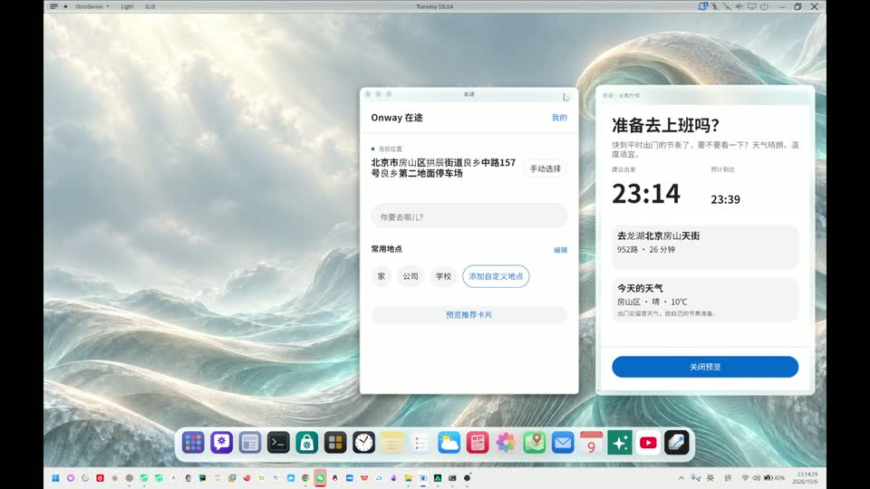

# 在途 Onway v1.0.2

**少糖加冰团队｜从准备出发到到达，呈现当下所需。**

在途 Onway 是围绕 OctoSense 开发的出行助手。用户输入目的地或保存固定通勤，应用结合路线、天气和偏好提供方案，并用随阶段变化的卡片呈现步行、候车、乘车和到达信息。

当前源码与审核资料版本为 **1.0.2**；可解压运行的 Windows 演示包版本为 **1.0.1**。1.0.2 主要补齐提交资料及后台依赖说明，没有另外发布 1.0.2 Windows 可执行包。

[视频介绍](#视频介绍) · [下载 Windows 演示包](https://github.com/buqizixv/shaotangjiabing/releases/tag/onway-v1.0.1) · [最新版本资料](https://github.com/buqizixv/shaotangjiabing/releases/tag/onway-v1.0.2) · [隐私说明](PRIVACY.md)

## 视频介绍

[](https://github.com/buqizixv/shaotangjiabing/releases/download/onway-v1.0.2/Onway-Introduction.mp4)

**[观看或下载 Onway 视频介绍（约 6 分 34 秒）](https://github.com/buqizixv/shaotangjiabing/releases/download/onway-v1.0.2/Onway-Introduction.mp4)**

视频为项目作者录制的 Windows 桌面操作，保留原声、界面与数据，展示 AI 出发邀请、路线选择、动态行程、阶段纠正、AI 总结及出行习惯等流程。行程阶段包含人工操作演示，录屏不作为完整户外定位实测证据。它是完整版介绍，未剪成三分钟赛事短片。

## “意图即应用”体现在哪里

1. **通勤意图 → 出发邀请。** 用户保存家、公司、上下班时间和日期。在宿主运行、AI/提醒/定位开启且位置有效的条件下，程序依据时间、位置和通勤设置形成候选意图，查询路线与天气，再由 AI 给出建议，呈现可确认、拒绝或稍后处理的出发卡。
2. **目的地 → 路线方案。** 输入目的地或选择常用地点后，查询实际路线并比较时长、步行和换乘；有效的 AI 建议在已有方案上显示推荐标记，最终由用户选择。
3. **当前阶段 → 当前卡片。** 同一个出行目标，随着准备、步行、候车、乘车、到达，显示对应信息和操作。
4. **完成记录 → 后续建议的上下文。** 开启 AI 时，行程总结与个性化记忆为下一次路线和通勤建议提供参考。

卡片由已有脚本和后台按状态切换。这是对意图驱动服务的探索，不声称 AI 在现场生成并安装全新应用。

## 立即体验

1. 打开 [onway-v1.0.1 发布页](https://github.com/buqizixv/shaotangjiabing/releases/tag/onway-v1.0.1)，下载 `Onway-v1.0.1-Windows-x64.zip`。
2. 完整解压，双击 `Onway.exe`。演示包包含配套宿主、Python、资源和共享网关访问凭证，无需自行填写网关凭证。
3. 允许系统定位或手动设置起点，搜索目的地并选择方案。
4. 在“出行习惯”开启 AI 功能；自动通勤邀请还需要提醒与定位开启、有效位置和符合通勤条件。可先在首页预览推荐卡片。

地图、天气、公交与 AI 需要网络和可用上游服务。

## 当前功能

- 实际路线查询、常用地点、时间/步行/换乘比较；有效 AI 推荐显示推荐标记，方案由用户选择。
- 准备出发、步行、候车、乘车、到达动态卡片；候车展示预计等待与车辆距离，数据不可用时明确说明。
- 按当前阶段人工纠正。进入行程隐藏主应用，关闭总结或中途结束返回主页。中途结束不创建历史。
- 固定通勤支持上下班时间、官方工作日或自选星期；结合真实路线与天气提供出发邀请，不会自动开始行程，也不判断实时道路拥堵。
- 到达后 AI 总结、个性化偏好与历史记忆；历史支持单条删除和全部清空，清空同步清除 AI 记忆。
- MiniMax、地图和天气通过密钥网关；北京公交公开接口单独查询。服务配置显示连接状态。

## 目录与运行

`bundle/` 是经过检查的 unsigned 首次审核包；`ui-v060.splash`、`card-v060.splash` 是 UI 源码；`backend/v060/` 是当前后台；`gateway/` 是服务器；`runtime/` 是必要的宿主补丁。v060 是内部模块和存储名称，1.0.2 不改数据格式。

需要 Windows、Python 3.11+、OctoSense 和 OctoScript-App-Design-Flow。后台使用标准库；SSH 部署工具另需 Paramiko。完整桌面体验需要 [runtime/README.md](runtime/README.md) 的补丁，普通未修改宿主不能自动管理本项目后台。

在此目录执行 `python -X utf8 build-v060.py`，再使用安装的 `tools/octo check bundle` 打戳检查；Windows 下设置 OCTO_HUB 为 hub.exe 的绝对路径。按工具本地签名、安装流程将 bundle 加入自己的宿主目录。签名密钥和目录信任锚由安装者管理，不能提交。listing 的发布者为 AimFx06，联系和隐私说明均指向本公开仓库。本次申请 App Hub 人工审核与宿主接入确认；未声称普通商店安装已兼容或已获准上架。见 [App Hub 提交说明](docs/AppHub提交说明.md)。

`launch.ps1` 接受 HostExe、DataDir 和 Anchor 三个必填参数。DataDir 必须包含已安装的 `onway/bundle/manifest.json` 和可信目录，不要与正在运行的实例共用数据。它设置后台需要的 ONWAY_APP_DIR、ONWAY_PYTHON 并启动宿主。源码构建、包检查和后台测试已验证；其他电脑从零安装仍未验证。此目录是源码，即用 Windows 演示包在 Releases 单独下载。

测试命令：

```powershell
python -X utf8 -m unittest gateway.test_server backend.v060.test_gateway backend.v060.test_initial_history backend.v060.test_v060 backend.v060.test_bus backend.v060.test_commute
```

## 服务与密钥

`gateway-client.json` 只有地址，`gateway-ca.pem` 是公开自签证书信任文件。源码自行运行需要配置网关访问凭证，可运行 `python -m backend.v060.configure_gateway`；凭证使用 Windows 用户级 DPAPI 保存。即用演示包另含共享访问凭证，不需要用户填写；源码和 App Hub bundle 不包含该共享令牌。

MiniMax 和地图密钥只放服务器；独立部署见 [gateway/README.md](gateway/README.md)。不要提交 secrets.env、私钥、访问令牌或 DPAPI 文件。网关失败不会自动回落绕过额度。

公交到站来自第三方车来了封装接口，可用性和覆盖取决于上游，不等同于官方保障服务；天气使用现有高德适配接口。

## 数据与边界

首次运行默认导入用户指定的 10 条历史及 AI 记忆，见 [backend/v060/data/README.md](backend/v060/data/README.md)。路线来自实际查询，日期和完成用时是编写导入，没有完整户外定位核验。升级、已有数据或清空后重启不会再次导入。

个人配置、行程与历史保存在宿主数据目录的 onway/ 下，不提交。Windows 桌面、实际路线/天气/公交接口、AI 推荐与总结、窗口切换已验证；完整户外连续行程、手机端、休眠后持续定位和系统通知尚未验证或接入。关闭整个 OctoSense 会停止后台。

## v1.0.1 即用演示包

Windows 演示包内置宿主、Python 和独立共享网关凭证，解压后打开 Onway.exe，不需填写凭证。源码不包含该共享凭证；修改网关地址不会把包内凭证发给其他服务器。演示网关按用户授权取消调用次数额度，保留请求大小和并发约束。演示包使用定制宿主，不等于标准 App Hub 安装即可获得全部功能。

演示包的本机数据位于 `%LOCALAPPDATA%/OnwayDemo/` 下的版本目录。共享服务的上游限制、并发约束或故障仍可能影响可用性，不保证无限可用或永久在线。数据处理与删除边界见 [隐私说明](PRIVACY.md)。

## v1.0.2 审核资料

补齐真实原生截图、发布者资料及 [隐私说明](PRIVACY.md)。没有配套后台的参考宿主运行 12 秒后明确显示依赖原因，避免持续展示连接中。截图分别展示当前源码配套后台首页与无后台的依赖页面，测试数据与个人运行数据隔离。完整检查输出与自检回答见 [审核目录](docs/apphub-review/)。原 v1.0.1 Windows 演示包继续可用；本次未改动后台业务或网关，也未修改个人历史。

[App Hub 人工审核申请 #102](https://github.com/OctoSense-org/OctoSense-App-Hub/issues/102) 已提交，尚未获准上架。1.0.2 审核包和 `onway-v1.0.2` 标签保持冻结；标签统一加上前缀后，冻结 listing 中指向旧 `v1.0.2` 标签的隐私链接失效，审核 Issue 已披露。当前有效说明为 [本目录隐私文档](PRIVACY.md)，后续适配版本需修正元数据地址。

## 反馈与许可证

[提交问题](https://github.com/buqizixv/shaotangjiabing/issues) 时注明 Onway、应用与宿主版本、复现步骤。不要粘贴 API 密钥、访问凭证或私钥。项目使用 [Apache-2.0](../LICENSE)，运行环境、字体和依赖的许可证以各自声明为准。
