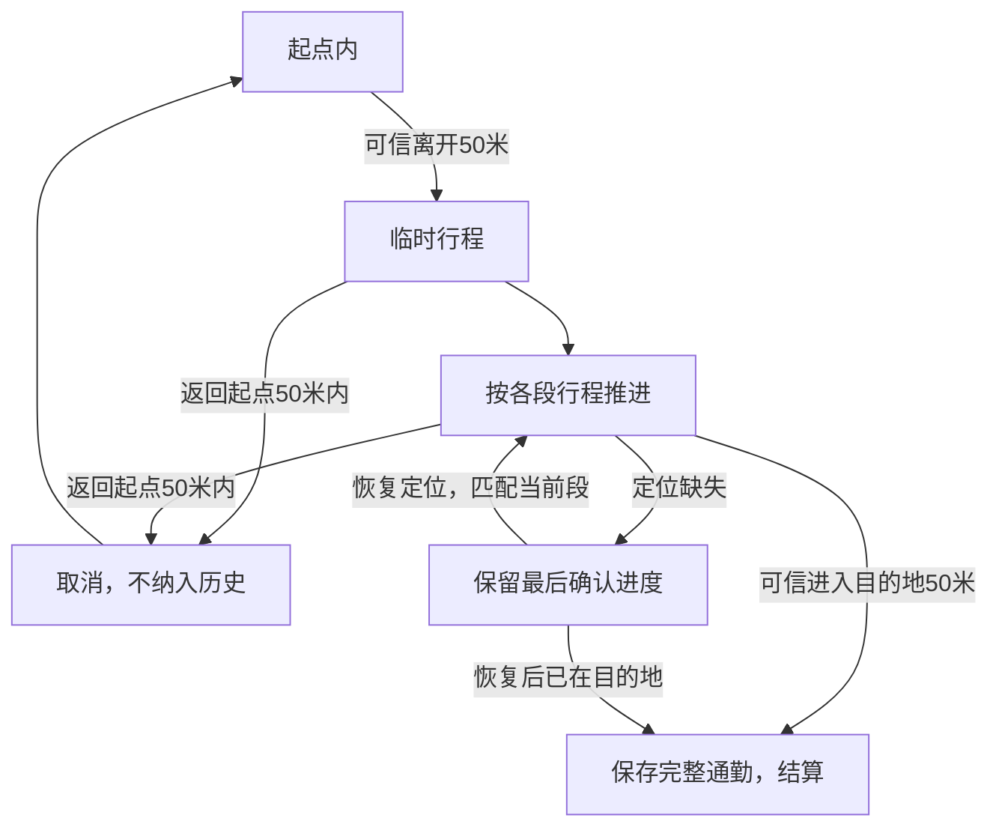

# 在途Onway 产品需求文档 V0.1.0

文档版本：V0.1.0  
修订日期：2026-10-02（北京时间）  
依据：用户提供的《BRIEF.md》及本轮五轮功能确认。  
状态：需求对齐稿；用于后续原型、技术验证与开发。本文中的功能要求不代表已实现或已接通数据。

复核日期：2026-10-02。本轮15项回答均已纳入第2节及对应场景。本文区分三类内容：第2节为用户已确认的产品决定；明确标为“建议”的判定规则、默认参数和扩展行为属于优化建议；第9节的数据接入、移动端选型和后台能力属于待验证事项。功能需求已对齐，技术实现规格尚未冻结。

## 1. 产品定位

为北京以公交、地铁为主的固定通勤用户，提供一个根据当前行程阶段自动变化的通勤助手：出门前看全程耗时和异常提前量，去站点时看步行与乘车信息，车上看可信进度，到达后看本次结果。

**一个场景只显示一张信息卡。**卡片内部内容随阶段变化，设置、选择方案和历史详情通过独立页面或展开面板访问。首页不同时铺开主卡、副卡、路线卡、站点卡和统计卡。

初次只要求标记家和目的地。随后提供通勤方案供用户选择，线路、上下车站、方向和换乘段从真实路线数据中获得。定位与通知的系统授权按功能需要申请。

## 2. 已确认的产品决定

| 项目 | 决定 |
|---|---|
| 首个验证城市 | 北京 |
| 核心出行方式 | 公交、地铁为主的固定通勤 |
| 首次设置 | 只标记家和目的地，其他信息按需补充 |
| 通勤方案 | 系统提供几种方案，用户选择并保存 |
| 站点关联 | 根据选定方案自动获得合适方向的上车站、下车站和换乘站 |
| 首页结构 | 每个场景只有一张信息卡，不区分主、副卡 |
| 出门前内容 | 现在出发约多久到；特殊情况使路程变长时提示提前量 |
| 提前量基准 | 个人历史通勤耗时，不要求首次填写目标到达时间 |
| 开始边界 | 距本次起点超过50米时开始临时记录 |
| 到达边界 | 进入本次目的地50米范围时结束通勤 |
| 场景切换 | 尽量自动判断，误判时允许纠正 |
| 短途外出 | 先临时记录；到目的地才保存完整通勤；返回起点自动取消 |
| 多次换乘 | 支持公交、地铁及多次换乘，卡片随各段行程切换 |
| 更好方案 | 提示用户；由用户主动选择采用或放弃 |
| 后台要求 | 锁屏、切换到其他应用后也必须能够记录 |
| 定位丢失 | 保留最后确认的行程进度，恢复定位后再更新 |
| 到达卡 | 已到达、本次耗时、与平常的差异；历史详情点开查看 |
| 产品通知 | 仅明显延误、需要提前出门时通知；正常通勤不每天提醒 |
| 真实数据 | 尝试接入真实路线、班次及路况；具体可用性需要验证 |

去程以“家→公司”举例。原说明中的“公司→家”返程场景建议保留，按同样的起点、目的地规则处理；返程方案应单独规划和保存，不直接反转去程站点。

## 3. 初次使用与日常使用

### 初次使用

1. 标记家和目的地。可用当前位置标记或搜索地点；选点方式按地图服务能力确定。
2. 获取真实通勤方案。每种方案提供预计总耗时、乘坐线路、步行量和换乘次数，供用户比较。
3. 用户选定一条方案，系统保存它的方向、上下车站、沿途站点和各段行程。
4. 在启用后台记录、异常通知时，解释用途并请求相应系统授权。
5. 尚无个人历史时，显示路线服务的预计耗时；不显示个人“平时耗时”和“建议提前多少”的推断。

首开标记地点、随后选择方案，是两步必要操作；不要求用户逐个录入整条线路、站名和每站时长。方案列表属于选择流程，不属于多个场景卡同时展示。

### 日常使用

系统根据保存方案、当前位置、个人习惯和新数据显示当前场景。正常完成一趟通勤不要求逐次点击“我要出发”“我上车了”“我到了”。卡片保留纠正入口，用于误判和定位无法提供充分证据的情况。

保存方案持续有效。路线服务返回新的更快方案时，不能静默覆盖用户原来选定的线路。

## 4. 场景与触发规则

“可信定位”指定位时间、精度和连续观测足以支持该判断；其具体参数需要实机验证。所有阶段以已保存方案的实际分段顺序为依据。下表中候车、上车和下车的复合判定是建议实现规则，不是用户已确定的数值阈值。

| 场景 | 进入条件 | 单张卡的内容 | 退出条件 / 下一阶段 |
|---|---|---|---|
| 首次准备 | 家、目的地或通勤方案尚未完整设置 | 当前缺少的步骤、设置入口；有真实方案结果时展示选择入口 | 保存通勤方案 |
| 无当前行程（建议默认） | 无临时行程，位置不在当前可识别的常用起点，也没有可恢复或已确认的进行中行程 | 当前没有通勤记录中；查看保存方案或补记入口 | 回到常用起点→准备出门；用户补正或确认已有行程→采用确认后的状态 |
| 准备出门 | 无正在进行的临时行程；可信位置位于本次常用起点，时间习惯用于辅助选择方向和更新数据 | 目的地、现在出发预计总耗时与到达时间；数据充分时显示平时参考和异常提前量 | 可信定位离开起点50米范围，创建临时行程 |
| 前往上车站 | 已创建临时行程，尚未确认进入第一段乘车 | 走到所选上车站还需多久、站名、线路、方向、下车站；有可用数据时显示来车时间 | 接近方案对应上车站且出现停留证据→候车；已确认沿乘车线路推进→乘车 |
| 候车 | 位于当前段正确方向的上车站附近，并有停留或用户纠正证据 | 当前线路和方向、来车信息、下车站、预计到目的地时间；标注班次数据性质和更新时间 | 位置序列沿所选乘车段连续推进、方向和速度等证据支持上车→乘车；用户纠正时同步更新 |
| 乘车中 | 有可信证据表明正在当前公交或地铁段上 | 当前已确认进度、下车站、可信剩余站数、剩余全程时间及预计到达时间；下一站仅在能可靠确定时显示 | 到本段下车站且有下车证据→换乘或最后步行段 |
| 换乘 | 当前乘车段结束，选定方案仍有后续乘车段 | 当前换乘任务、下一条线路和方向、上车位置、步行时间、可用的来车信息、剩余全程时间 | 到下一段上车位置→候车；确认上车→下一段乘车；可按真实观测跳过未被观察到的中间阶段 |
| 下车后步行 | 最后一段乘车结束，当前处于通往目的地的步行段 | 到目的地剩余步行时间与距离；有可靠入口信息时显示入口指引 | 可信定位进入目的地50米范围→到达结算 |
| 已到达 | 存在本次临时行程，可信定位进入目的地50米范围 | 已到达、本次实际耗时、与平常的差异、查看历史入口 | 用户关闭结果、开始下一趟行程或进入下一次准备阶段；建议在本次打开期间保留结果 |
| 临时行程取消 | 尚未到目的地，可信定位重新进入原起点50米范围；或用户主动取消 | 回到当前起点的准备状态，不展示成功结算 | 下一次可信离开起点时创建新临时行程 |

### 4.1 用户纠正和自动判定的关系

- 更正当前阶段、线路或上下车状态后，系统从更正后的状态继续，不能马上用旧数据改回。
- 建议提供“还在等车”“已经上车”“已经下车”“取消本次”等按当前场景出现的轻量操作，不作为每天必点流程。
- 更正时间会影响耗时；记录需保留实际采用的起止时间和是否经过用户确认。
- 仅靠近任意站点、单个位置点变化、估计时间已过，都不能单独证明已上车或已下车。

### 4.2 进入站点的信息与场景是两回事

选定方案后，上车站、下车站、方向和到站步行时间就应能展示；不必等用户进入某个300米圈才出现。

位置仍用于判断“正在走向站点”“已经在站点候车”“正在乘车”。它是行程识别证据，不是站点信息首次显示的唯一开关。

### 4.3 状态冲突的处理

1. 当前用户纠正优先采用；后续新观测再继续验证。
2. 定位缺失或不可信时冻结进度，不能由时钟驱动跳站。
3. 定位恢复后，优先检查有效到达和返回起点取消，再匹配当前行程段。
4. 当前行程段决定卡片，通勤时间窗口不能把乘车卡改回出门前卡。
5. 恢复定位后可以直接进入已确认的实际阶段，不逐个播放错过的状态。

## 5. 50米边界与临时记录

### 5.1 记录流程

常用起点内 → 可信离开50米 → 创建临时行程 → 行程推进 → 可信进入目的地50米 → 保存完整通勤。

尚未到目的地就返回原起点50米范围 → 取消临时行程 → 不进入有效历史和习惯学习。

开始和结束时间使用首次可信满足条件的定位事件时间。可以用后续观测确认这个事件，不把确认等待时间额外算进耗时；不能仅用回调抵达手机的时间代替定位采样时间。

实际通勤耗时 = 有效到达时间 − 有效离开时间。它包含站点前步行、候车、乘车、换乘和到达前步行；不能只统计车上时间。

### 5.2 防止漂移与重复结算

- 50米保留为用户确认的业务边界，不能未经说明自动改成100米或150米。
- 使用定位精度、采样时间和连续观测确认进出；一次跳点不能直接生成或结束通勤。
- 单次行程只有一个开始和一个有效结束；范围边缘来回抖动不得反复创建、结算。
- 没有可信起点离开事件时，不能仅因人在公司就制造一条完整通勤。
- 定位缺口导致无法确定起点离开或终点到达事件时，标为待确认或不完整，允许补正；不能伪造确切越界时间。只缺失中间位置、起止事件仍可信的行程，可以保存为有效通勤。
- 临时行程、当前阶段、用户纠正和已处理事件应持久化，以便切应用、锁屏和重启后恢复。
- 对于偏离方案或长时间未完成的行程，建议保留为待确认；不通过超时猜测已经到达。

### 5.3 用户不是去公司的情况

离家本身只能证明“开始一次外出”，不能证明“正在通勤”。到目的地才确认完整通勤，短途返回起点自动取消。路线方向与推进证据可以帮助减少卡片误判，但不将固定7:00–9:00、17:00–19:00写成唯一记录条件。

若绕路后最终到公司，按两个50米事件之间的实际时间记录；明显绕路或停留较长的样本建议标记，避免直接改变正常路线基准。这属于建议默认规则。

## 6. 耗时、历史学习与异常通知

### 6.1 两类时间分开

| 时间 | 含义 | 来源 |
|---|---|---|
| 预计全程 / 剩余时间 | 现在按所选方案继续，预计还需多久 | 路线分段、可用实时数据、可信行程进度、个人历史修正 |
| 本次实际耗时 | 从离开起点50米到进入目的地50米的观测耗时 | 本次可信定位事件；必要时由用户补正并标记 |

到达卡的差异 = 本次实际耗时 − 本次记录写入前的可比历史基准。本次记录不能先计入基准，再用更新后的基准与自己比较。没有可比基准时只显示本次耗时；采用另一条方案后，应使用新方案的可比历史，缺少该方案历史则不显示个人差异。

预计耗时优先使用选定方案的实际分段及数据服务估计，包括步行、候车、乘车、换乘和最后步行。不能用当前位置到目的地的直线距离直接换算公交耗时，也不能把家到公司的驾车时间直接当公交时间。

路线服务若已把等车时间纳入总耗时，不能重复加一遍。更新时保持当前方案身份，不能把新返回的另一条路线耗时套在原方案上。

### 6.2 提前量

当同一方向、同一方案平时约30分钟，今天预计40分钟：

> 今天约40分钟，比平常多10分钟，建议提前10分钟出门。

建议提前量 = max(0，当前预计全程耗时 − 可比历史基准耗时)。

有学到的平常出发时刻时：建议出发时刻 = 平常出发时刻 − 建议提前量。不强制要求用户输入工作打卡截止时间。

原因有真实证据时可以说明，例如“沿途拥堵”。仅发现预计耗时变长时，应写“预计比平常多10分钟”，不把所有变慢都归因于堵车。

### 6.3 历史学习的建议默认规则

以下是本次优化建议，便于实现；并非用户逐项确认的固定参数：

- 按方向、保存方案版本和相近出发时段分组，去程与返程分开。
- 同组至少3次可信完整记录后建立个人基准；优先使用最近7次正常记录的中位数，减少单次异常的影响。
- 出发习惯来自有效记录的离开时间；不能仅凭打开应用的时间学习出发时刻。
- 取消、临时返回、缺失起止事件、演示数据、未经确认的补记不用于正常基准。
- 用户切换到新方案后，先用该方案的真实规划估计；新旧方案的耗时不能直接混作一个基准。
- 无可比历史时只显示当前预计耗时，到达后只显示本次实际耗时。

### 6.4 仅异常时发产品通知

通知需要同时满足：

1. 本次尚未出发，仍有提前出门的行动价值。
2. 有可信个人基准与出发习惯，并且当前方案的估计有效、足够新。
3. 今天预计耗时相对可比基准出现明显增加。
4. 通知权限可用。

建议沿用原说明的“增加至少10分钟”作为明显延误的初始阈值，后续根据实际误报情况调整；10分钟是建议默认，不是用户已确认的精确通知阈值。

应在学到的通常出发时间之前检查异常，并尽量早于调整后的建议出发时间提醒。同一方向、同一天、同一次延误建议只主动通知一次；普通数值刷新不重复打扰。用户已经出发后不再发“提前出门”通知。

正常通勤不每天提醒。到达成功、返家取消、正常换乘不默认新增主动通知。系统为运行定位服务必须展示的服务状态提示，属于系统实现要求，需在选型时核查。

## 7. 更好方案与多次换乘

### 更好方案

发现另一方案更快时，在当前一张卡内提示，例如“有更快方案，预计少10分钟”，提供查看、采用或放弃入口。

仅在用户采用后替换当前或保存方案，并同步替换站点、乘车方向、步行段、换乘段和预计耗时。放弃后继续使用原方案，同一次比较不持续重复提示。新的日常默认方案是否永久保存，可在采用时通过轻量选项决定。

第一版已确认的比较场景是出门前。途中发现和采用更好方案属于后续扩展建议，不作为本轮已确认的第一版必做功能。若后续启用，也应由用户决定，并从当前位置重新规划。

### 换乘

一条方案按顺序保存：步行段 → 乘车段 → 换乘步行段 → 下一乘车段 → 最后步行段。支持多个公交、地铁乘车段。

每次换乘更新当前卡片上的下一条线路、方向、上车位置、可用来车信息和剩余全程时间。所有分段属于同一次临时行程，只有进入最终目的地50米范围才结算；不能在每个下车站结束整趟通勤。

## 8. 定位与数据异常

| 情况 | 页面与记录处理 |
|---|---|
| 地铁隧道或其他位置暂时无定位 | 保留最后确认的场景、站点进度，显示定位暂不可用和最后更新时间；不按已过分钟自动跳站 |
| 上一次预计到达时间已失效 | 标为上次估计，不当作当前可靠ETA；不继续显示伪精确的实时倒计时 |
| 定位恢复 | 根据新观测重判当前段；若已在最终目的地并且存在有效行程，直接检查结算 |
| 定位精度不足以支持50米判定 | 保持状态，等待可信位置；提供用户纠正入口 |
| 后台定位未授权或被系统限制 | 显示自动记录能力受限；允许手动纠正和补记，缺失记录不伪称完整自动通勤 |
| 通知未授权 | 应用打开时仍显示异常提前量，不能声称已成功发送通知 |
| 公交实时到站无覆盖 / 接口失败 | 保留站点、线路和方向；显示暂无实时到站数据，或明确标为计划/估算的值 |
| 路况无可靠依据 | 可展示有效的预计耗时变化，不能直接断言堵车 |
| 路线服务失败，有缓存 | 展示缓存方案及更新时间；过期耗时不得标为实时 |
| 路线服务失败，无缓存 | 展示无法获取方案及重试入口，不编造公交站和班次 |
| 个人历史不足 | 展示当前规划估计或本次耗时，不显示不存在的个人比较 |
| 演示模式 | 全部模拟位置、时间和班次明确标注，不能写入个人真实历史或发送真实异常通知 |

定位缺失时冻结的是已确认的行程进度，不是重置出发时间。实际经过的时间仍然存在；最终记录须说明起止事件是否可信、是否有缺口。中途进度未知，但起点离开和终点到达均可信时，完整耗时依然有效，可用于通勤记录和可比历史；不能因为地铁隧道中的定位缺失就一律排除整趟通勤。

## 9. 真实数据与运行环境验证

### 9.1 数据分层

| 数据 | 目标来源 | 已知能力 / 待验证事项 |
|---|---|---|
| 通勤方案、步行段、公交地铁段、上下车站 | 官方路线规划与站点线路服务 | 高德公开路线规划支持多个方案、分段和预计总耗时；实际北京样例、权限与配额待调用验证 [S1][S2] |
| 某班公交还有多久到站 | 可授权的车辆实时到站数据源 | 不能仅凭路线规划或线路查询接口认定已获得实时到站；北京具体城市、线路覆盖及接入条件待验证 |
| 地铁下一班 / 发车间隔 | 运营方或可授权时刻、运营数据 | 计划发车间隔与实际下一班分开标注；来源与可获取性待验证 |
| 沿途拥堵与异常 | 可授权路况服务，匹配当前公交地面段 | 高德交通态势查询提供相应能力，属高级服务；权限、覆盖和可量化的时间影响待验证 [S3] |
| 当前位置与定位精度 | 手机系统定位 | 后台授权、持续更新、精度、事件延迟、坐标系需要真实手机验证 |
| 通勤耗时和作息 | 本地有效定位记录 | 自动积累，按方向和方案分组；异常与演示数据隔离 |

请求频率、缓存时效和供方选择属于后续技术验证，不在需求稿里伪装成已接通结果。先用北京一条完整行程验证端到端，再验证多次换乘与不同线路覆盖。

位置与路线数据必须统一坐标系，再做50米判断、站点距离和路线匹配。各字段要保留来源、采样或更新时间与数据性质。接口密钥在后端管理，不放进应用包；后端请求真实数据并向客户端返回业务结果。

### 9.2 后台是第一版必须通过的能力

用户已明确允许调整运行环境，以获得锁屏和切应用后的自动记录。原BRIEF列出的宿主无后台与通知能力，因此它目前不满足新版完整需求。后台定位、位置事件持久化及异常通知必须在选定的真实移动端环境验证。

Android公开文档说明普通后台定位更新受到频率限制，可使用相应定位服务机制；Apple也提供后台位置更新能力。实际授权、系统行为与目标设备适配仍需验证 [S4][S5]。普通页面刷新定时器或后端代理不能代替手机后台定位。

Android围栏文档建议更大的围栏半径，且后台事件可能存在分钟级延迟 [S6]。**50米在本项目中保留为业务边界，但不能只依赖系统围栏回调承诺立即、准确打卡。**建议采用外围事件唤醒或降低常态采样成本，再在行程活跃时用可信定位确认50米越界。具体机制不预先限定，必须用实机结果证明。

移动端系统、开发框架与原参赛提交的兼容方式尚未决定。若仍需原环境提交，应另核对赛事允许的环境和交付条件；不能把仅前台演示标为已满足后台功能。本文不替用户自动创建两个产品版本。

## 10. 界面与视觉约定

- 延续原BRIEF的Apple风格：留白、清晰中文、圆角、简洁操作。
- 首页仅一张当前场景卡，线路与时间信息在卡内分组，不再显示常驻上班、回家、站点、统计卡列表。
- 家、目的地、方案选择、历史详情使用独立页面或面板，避免在日常卡中堆设置表单。
- 原颜色令牌可保留：主文案 `#1d1d1f`、次文案 `#7a7a7a`、交互蓝 `#0066cc`、页面底 `#f5f5f7`、卡底 `#ffffff`、强调暗卡 `#272729`、警告 `#ff9f0a`。
- 卡内保留简短数据来源 / 更新时间；定位丢失和班次不可用是当前卡的状态，不叠加另一张失败卡。
- 到达卡只显示已到达、实际耗时和差异；均值、最快、连续次数、趋势图放进历史详情。
- 入口或出口指引有可靠数据才显示，不默认编造“南门更近”。

## 11. 开发前验收清单

以下是行为验收场景，不是已经执行的测试。

| 编号 | 场景 | 应有结果 |
|---|---|---|
| A01 | 首开，只标记家与目的地 | 能查询并选择真实通勤方案；不要求手填整条线路；无个人历史比较 |
| A02 | 选定方案，人仍在家 | 已能查看正确方向的上车站、下车站和步行时间，不必先接近300米 |
| A03 | 同方案历史30分钟，当前可靠预计40分钟 | 显示约40分钟、建议提前10分钟；正常路线不被自动替换 |
| A04 | 存在更快方案，用户放弃 | 继续原线路、站点和耗时，不静默切换 |
| A05 | 存在更快方案，用户采用 | 全部行程段和方向同步更新，按新方案推进 |
| A06 | 离家50米买东西，随后回家 | 临时行程取消，不增加有效通勤记录或改变基准 |
| A07 | 锁屏后离家，切其他应用，最终到公司 | 在授权与系统允许条件下真实捕获起止事件，完成记录，不以手动演示代替 |
| A08 | 单次定位跳出或跳入50米，后续观测矛盾 | 不错误创建、结束或重复结算通勤 |
| A09 | 路过站点但尚未乘车 | 不仅凭距离就判定已经上车；支持纠正 |
| A10 | 公交→地铁→公交，多次换乘 | 单张卡逐段更新，整趟只在最终目的地结算一次 |
| A11 | 地铁中无定位且经过时间超过预计单站耗时 | 保持最后确认的进度与更新时间，不自动跳站 |
| A12 | 定位恢复时已经跨过数段行程 | 按实际新证据更新，不补播虚构的中间站 |
| A13 | 到达公司50米范围内，定位可信 | 结束并保存完整行程，展示已到达、实际耗时和差异；详情点开查看 |
| A14 | 到达后应用重启或位置在边缘波动 | 不重复生成同一趟记录 |
| A15 | 实时公交无覆盖、路况失败或缓存过期 | 如实呈现缺失 / 计划 / 估算 / 缓存，不能显示假的实时倒计时或拥堵原因 |
| A16 | 基准、数据、通知权限具备，出门前出现明显延误 | 在有提前行动价值时发一次异常通知；正常通勤不每天提醒 |
| A17 | 起点离开事件缺失、后台权限被关闭 | 标为不完整或待补正；不能写入一条伪精确完整通勤 |
| A18 | 各个场景、失败状态、到达状态 | 首页始终只呈现一张当前信息卡，历史和方案选择另行访问 |
| A19 | 起止事件可信，中途因地铁隧道失去定位 | 中间进度冻结，最终仍保存有效全程耗时，不因中间缺口排除整趟记录 |
| A20 | 写入一条新的完整通勤记录 | 到达差异使用写入前的可比基准，本次样本不参与与自己的比较 |

## 12. 相对原BRIEF的调整

| 原说明 | 新需求 |
|---|---|
| 零输入，同时要求配置线路、手动打卡 | 首开只标记地点，选择真实方案；后续自动记录，操作用于纠正 |
| 主卡置顶，同时有常驻副卡和统计卡 | 每个场景一张卡，内容按行程阶段更新 |
| 任意已保存站点300米内才显示班次 | 选定方案即可显示站点相关信息；候车判断结合指定站点、方向与停留证据 |
| 用户手动上车，地铁按时间推算跳站 | 自动判断与纠正；无定位时保留最后确认进度 |
| 暂无公交数据，默认示例 / 手动时刻表 | 尝试真实数据，逐层验证；无覆盖明确降级，不把规划估计称实时 |
| 无后台、无通知，只前台运行 | 后台记录和异常提前通知成为必须验证的能力，允许调整环境 |
| 点击我到了或下次打开推断已完成 | 可信起点50米外、终点50米内自动记录；缺失事件单独标记 |
| 单线路进度 | 多乘车段、多次换乘，最终目的地统一结算 |
| 每次到达展示统计卡和近7次图 | 到达卡精简，详细历史另看 |
| 固定时段和距离规则；禁止调整判定引擎 | 以本次新需求作为修订依据；时间用于习惯辅助，实际行程证据主导阶段 |

原文件报告的六态截图、持久化和包检查结果只能描述旧实现。新版后台、真实数据、多方案选择、多次换乘和自动边界记录，应按照本稿重新验收。原视觉细节、命令和构建规则仍可作为实现资料，不能覆盖本轮用户明确决定。

## 13. 公开技术资料

以下资料用于说明公开能力和限制，核查日期为2026-10-02；它们不代表本项目已拿到权限、完成接口调用或通过实机测试。

- [S1 高德路径规划2.0：公交多方案、分段、总耗时](https://lbs.amap.com/api/webservice/guide/api/newroute)
- [S2 高德公交信息查询：线路、站点和运营时间](https://developer.amap.com/api/webservice/guide/api-advanced/bus-inquiry)
- [S3 高德交通态势查询：高级服务与覆盖](https://developer.amap.com/api/webservice/guide/api-advanced/traffic-situation-inquiry)
- [S4 Android后台定位限制](https://developer.android.com/about/versions/oreo/background-location-limits)
- [S5 Apple后台位置更新](https://developer.apple.com/documentation/corelocation/handling-location-updates-in-the-background)
- [S6 Android地理围栏：半径、停留和后台事件延迟](https://developer.android.com/develop/sensors-and-location/location/geofencing)
